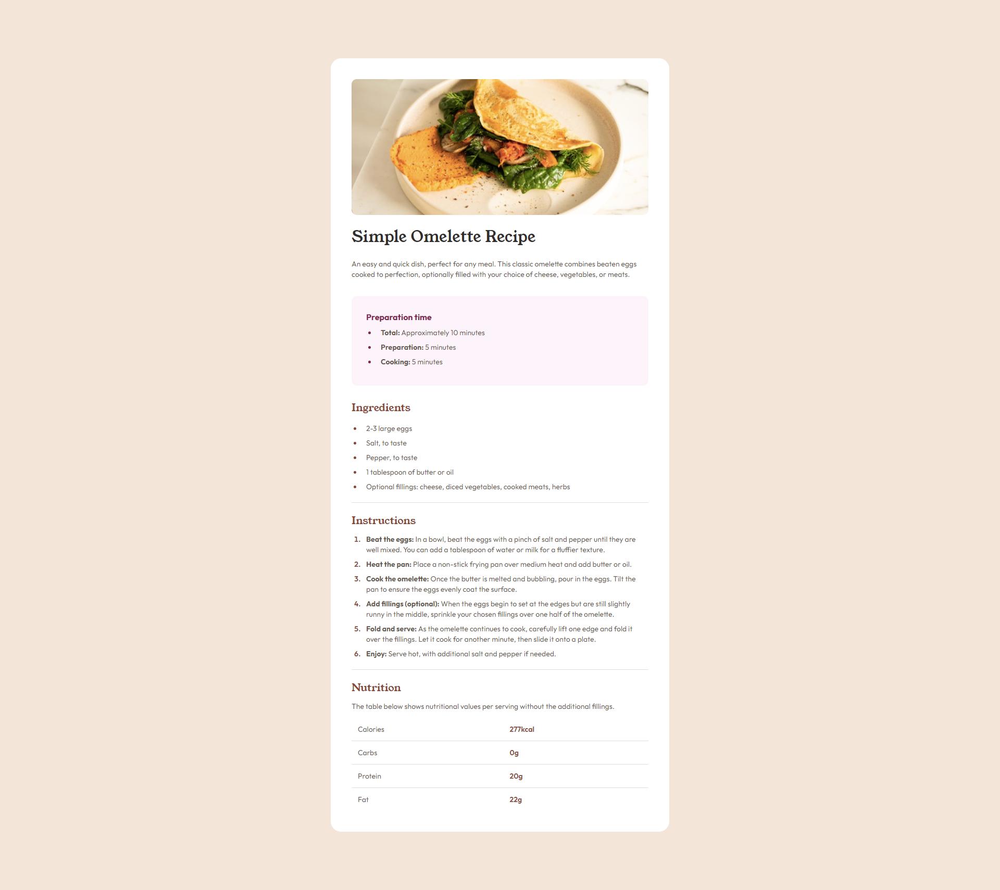

# Frontend Mentor - Recipe page solution

This is a solution to the [Recipe page challenge on Frontend Mentor](https://www.frontendmentor.io/challenges/recipe-page-KiTsR8QQKm). Frontend Mentor challenges help you improve your coding skills by building realistic projects.

## Table of contents

- [Overview](#overview)
  - [The challenge](#the-challenge)
  - [Screenshot](#screenshot)
  - [Links](#links)
- [My process](#my-process)
  - [Built with](#built-with)
  - [What I learned](#what-i-learned)
- [Author](#author)
- [Acknowledgments](#acknowledgments)

## Overview

### Screenshot

### Links

- Solution URL: [Add solution URL here](https://www.frontendmentor.io/solutions/social-links-profile-n2aO4ct-KU)
- Live Site URL: [Add live site URL here](https://lost50u1.github.io/social-links-profile-main/)

## My process

### Built with

- Semantic HTML5 markup
- CSS custom properties
- Flexbox
- CSS Grid
- Mobile-first workflow
- [Tailwind CSS](https://tailwindcss.com) - Utility First Css Class

### What I learned

- i learned to use tailwind css

## Author

- Website - [Biruk Moges](https://lost50u1.github.io/)
- Frontend Mentor - [@lost50U1](https://www.frontendmentor.io/profile/lost50U1)
- Twitter - [@cc64e15cb0f543a](https://www.twitter.com/@cc64e15cb0f543a)
